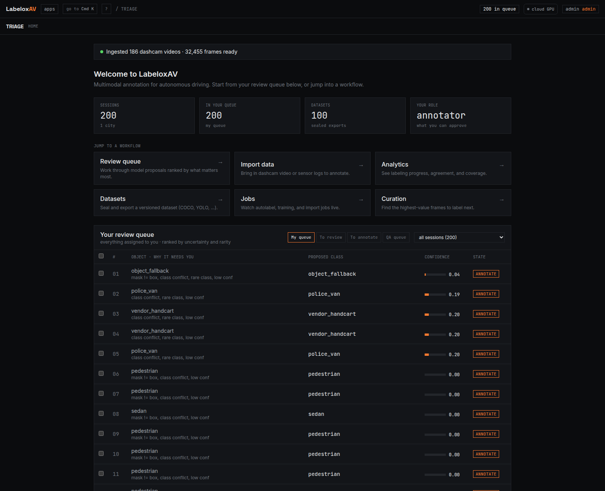
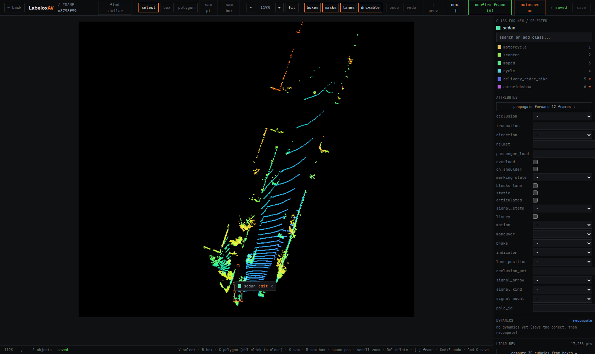

# LabeloxAV

**A data engine for autonomous driving, built for Indian roads.**

It takes raw fleet footage, auto labels it with a calibrated confidence gate, mines the rare and risky moments, builds HD map layers, and then improves its own models in a closed loop. The human stops being a labeler and becomes a governor.

One ontology, 170 classes, tuned for the chaos that global datasets never saw: autorickshaws, cattle on the carriageway, overloaded two wheelers, hand carts, street vendors, and the long tail of everything else.



*The home dashboard: a full fleet of real dashcam drives ingested and ready (186 trips, 32,455 frames from Indian roads), with the review queue surfacing the long tail the models struggle on, police vans, vendor handcarts, autorickshaws, ranked by uncertainty and rarity so attention goes where it matters.*


---

## Why this exists

Most perception models are trained on clean, orderly roads. Put them on an Indian street and they struggle: dense mixed traffic, classes that simply do not exist elsewhere, lane markings that are more of a suggestion, and safety critical moments buried under thousands of boring frames.

Labeling that data by hand is slow and expensive. The cases that actually matter are the hardest to find. LabeloxAV is the engine that turns drives into a training set that keeps getting better, while a person watches over it instead of clicking boxes all day.

---

## What it does

**One surface, every annotation primitive.** Boxes and oriented boxes, manual polygons, promptable SAM masks, pose and keypoint skeletons for pedestrians and cyclists, and 3D cuboids lifted from LiDAR, plus a measure tool and copy paste across frames. Edit lane splines and drivable area, read each object's derived dynamics, fix a wrong label in place, or add a brand new class on the fly. All keyboard driven. Here it is on a real Indian street, with a truck, an autorickshaw, a hatchback, and pedestrians.


**Start from raw data.** Drop in a folder of images, a whole batch of dashcam videos, or an mcap and it imports each into its own session with faces and plates blurred before anything reaches storage, then opens the first frame so you are annotating in seconds. The home shows live ingest progress across the batch, and sends you straight back to the highest priority frame left to label.

**3D from LiDAR, without a 3D engine.** Point clouds rasterize to a bird's eye view you annotate with oriented boxes, and each box lifts back to a metric 3D cuboid using the points it encloses. It exports as real nuScenes 3D. The shot below is a real KITTI scan, annotated in the same editor.



**Smart triage, not endless clicking.** Every detection gets a calibrated confidence and a reason. High confidence agrees get auto accepted. The uncertain, rare, and conflicting ones rise to the top of a priority queue. You spend your attention where it matters.


**Active learning that asks for the right frames.** Instead of labeling random data, the engine ranks every candidate by how much it would teach the model: uncertainty, diversity, rarity, and error proneness combined into a single value score. Label the top of the list, skip the redundant easy frames.


**A closed loop you can govern.** Corrections and mined hard cases feed a versioned training set. The model retrains, gets measured against a frozen gold set, and is promoted only if it beats the champion without regressing a safety class. Then it relabels the existing data, surfaces the errors that remain, and the cycle repeats. Over each turn the auto accept ceiling rises and human touches fall.

Every automated decision is in an audit log. A drift breach pauses promotion. One kill switch stops everything and rolls back to the last good model. Safety critical confusion, like a rider mistaken for a pole, is never automated to zero.


---

## The feature list

- **India first ontology**, 170 classes across vehicles, vulnerable road users, infrastructure, surfaces, and an honest long tail, with per object behavioral attributes (motion, brake, indicator, lane position, occlusion).
- **A full annotation toolkit**: boxes, oriented boxes, manual polygons, promptable SAM masks, pose and keypoint skeletons, 3D cuboids from LiDAR, a measure tool, and copy paste, with per object undo, optimistic locking so two people never clobber each other, and autosave.
- **Auto labeling** through a fusion of detection, promptable segmentation, and a vision language verifier, gated by calibrated confidence.
- **Perception depth**: multi object tracking, lane splines, drivable area segmentation, traffic sign and signal understanding, and license plate privacy that never stores plate text.
- **3D and LiDAR**: point clouds annotated in a bird's eye view, lifted to metric cuboids from the enclosed points.
- **Multi sensor and spatial**: camera calibration validation, synchronized multi camera annotation, map assisted labeling from OpenStreetMap, and HD map generation exported to Lanelet2 and OpenDRIVE.
- **Derived dynamics**: per object distance, speed, heading, time to collision, and a risk level, turning a perception dataset into one that supports planning and prediction.
- **Self improvement**: active learning, annotation error detection, AI assisted relabeling, champion and challenger promotion that actually serves the promoted model, a kill switch that genuinely stops auto accept, control sample precision, drift detection with recovery, and a full audit trail.
- **Export and import**: COCO, YOLO, KITTI, BDD100K, OpenLABEL, nuScenes (with real 3D when a cuboid exists), and a lossless Parquet round trip.
- **Secure and versioned**: deny by default API auth with annotator, reviewer, and admin roles, git style branches and reviewed merges over the dataset, and a mandatory privacy gate.

---

## Architecture

```
Fleet footage
   |
   v
Ingest  ->  Auto label (confidence gate)  ->  Triage and review
   |                                              |
   |                                              v
Embeddings, search, rare scenario discovery   Corrections
   |                                              |
   v                                              v
HD maps, calibration, dynamics            Active learning
                                               |
                                               v
                       Retrain  ->  Champion gate  ->  Relabel  ->  Error detection
                                       (governed, audited, reversible)
```

**Stack.** Python and FastAPI, Next.js and Tailwind, Postgres with PostGIS and pgvector, MinIO object storage, Redis, Redpanda, and lakeFS for dataset versioning. Models run on PyTorch with a clean local to cloud seam.

---

## Quick start

```bash
# bring up the infrastructure (Postgres, MinIO, Redis, Redpanda, lakeFS)
make up

# install and migrate
uv venv && uv pip install -e .
alembic upgrade head
python scripts/seed_ontology.py

# run the API and the web app
make api      # http://localhost:8000
make web      # http://localhost:3000
```

Open the web app, click New to upload images or video, or Open to pick an existing session, and start annotating.

---

## Models

Detectors live in a versioned registry, trained on the India Driving Dataset and a general 8 class set. A fresh size family, trained on a single consumer GPU:

| Model | Backbone | Data | mAP@50 | Precision | Recall |
| --- | --- | --- | --- | --- | --- |
| idd-yolo11l | YOLO11l | IDD | 0.44 | 0.67 | 0.39 |
| idd-yolo11n | YOLO11n | IDD | 0.34 | 0.67 | 0.30 |
| roadscope-yolo11l | YOLO11l | general | 0.72 | 0.73 | 0.65 |

The accurate IDD model reaches 0.44 mAP@50, a clear step over the earlier 0.39 baseline, while the tiny YOLO11n trades accuracy for speed so it can run on the vehicle. The model nails the common road agents and is weaker on the rare India specific long tail, which is exactly the gap the active learning loop is built to close. Every model is promoted only through the champion and challenger gate above.

## Honest status

This is a from scratch build of the full pipeline, end to end, backed by an automated test suite. The engine, the ontology, the closed loop, the governance, the maps, and the editor are real and verified.

The real data path is proven and now populated. A full fleet of real dashcam drives has been ingested: 186 trips and 32,455 frames from Indian roads, with faces and plates blurred before anything reaches storage. Real semantic segmentation models run the drivable surface and lane geometry across that corpus through the cloud GPU seam, which is now a wired dispatch that starts a pod, runs the sweep, ingests the result, and stops the pod to cap billing, rather than a promise. India Driving Dataset frames are embedded so search and discovery run on real pixels, a real KITTI LiDAR scan is annotated to 3D cuboids and exported as nuScenes, and detectors in the registry are trained on the India Driving Dataset and reach a real baseline.

The test suite once wrote to the same database as production and left synthetic frames behind; that is now fixed at the source (isolated test database, CI, and an ingest gate that rejects corrupt frames), and the residue was quarantined. What is left is to run the full closed loop on the new corpus at scale: autolabel every drive, mine the hard cases, retrain, and watch the auto accept ceiling climb. The pixels are real now, and the loop runs on them.

---

## Calibration and trust

A session that fails camera calibration is flagged and excluded from 3D and multi camera work until it is fixed. Trust is earned per session, not assumed.


---

## Author

**Sherin Joseph Roy**

Building an India native, self improving data engine for autonomous driving.

---

## License

Copyright (c) 2026 Sherin Joseph Roy. All rights reserved.
