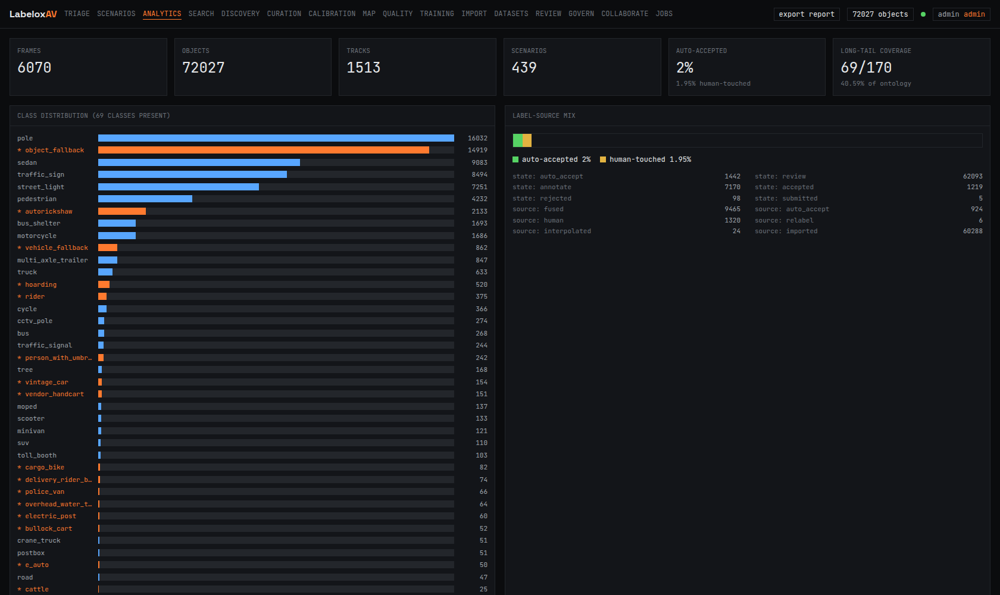
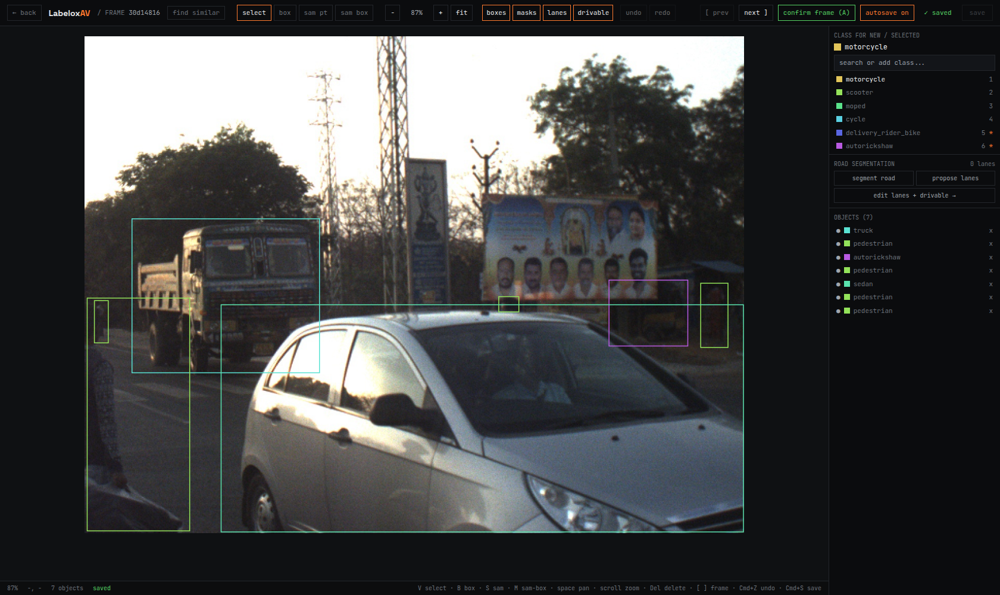
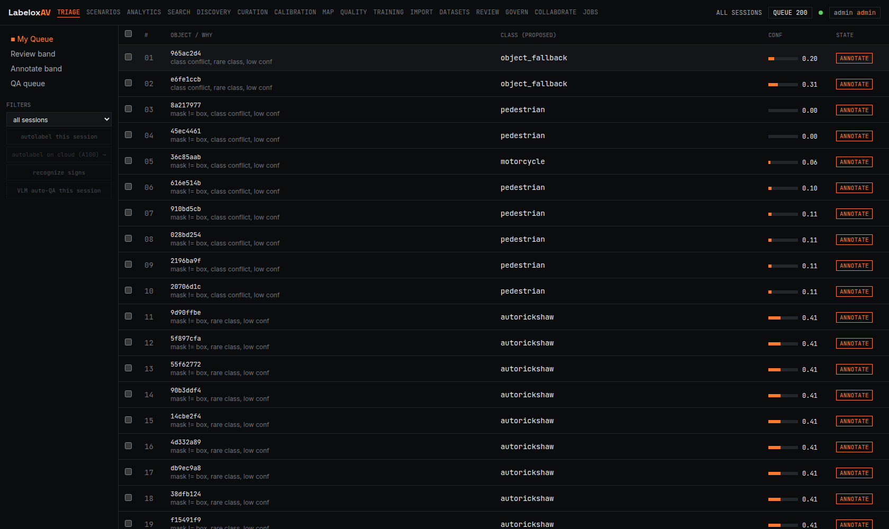
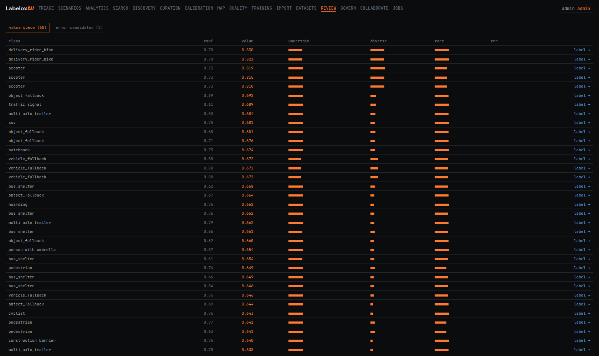
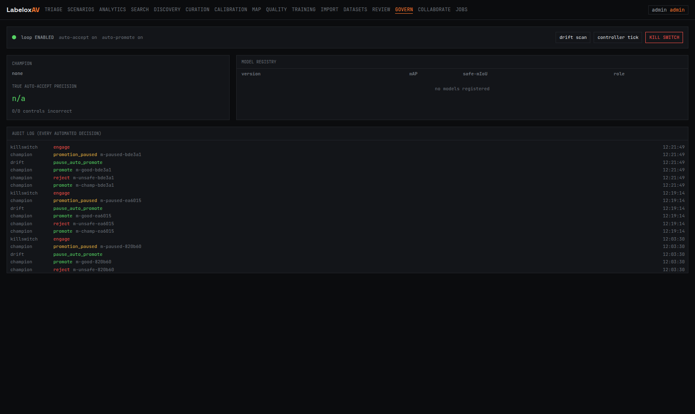
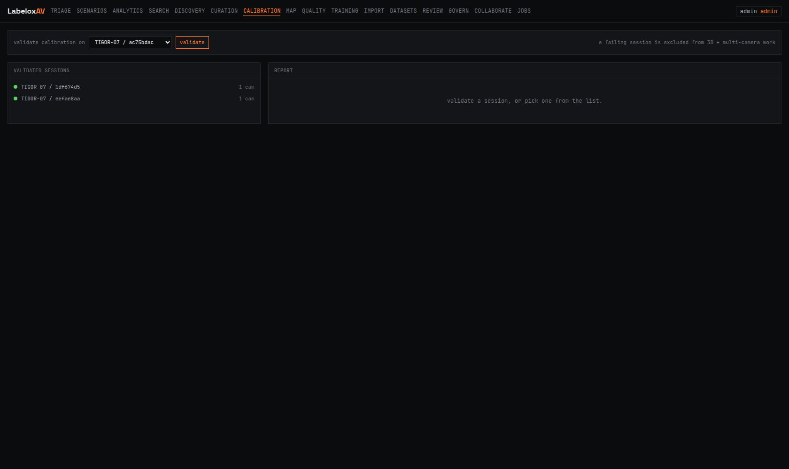

# LabeloxAV

**A data engine for autonomous driving, built for Indian roads.**

It takes raw fleet footage, auto labels it with a calibrated confidence gate, mines the rare and risky moments, builds HD map layers, and then improves its own models in a closed loop. The human stops being a labeler and becomes a governor.

One ontology, 170 classes, tuned for the chaos that global datasets never saw: autorickshaws, cattle on the carriageway, overloaded two wheelers, hand carts, street vendors, and the long tail of everything else.



---

## Why this exists

Most perception models are trained on clean, orderly roads. Put them on an Indian street and they struggle: dense mixed traffic, classes that simply do not exist elsewhere, lane markings that are more of a suggestion, and safety critical moments buried under thousands of boring frames.

Labeling that data by hand is slow and expensive. The cases that actually matter are the hardest to find. LabeloxAV is the engine that turns drives into a training set that keeps getting better, while a person watches over it instead of clicking boxes all day.

---

## What it does

**One annotation canvas.** Draw and adjust boxes, run promptable segmentation, edit lane splines and drivable area, toggle layers, and read each object's derived dynamics, all on a single keyboard driven surface. Click a wrong label and fix it in place, or add a brand new class on the fly. Here it is on a real Indian street, with a truck, an autorickshaw, a hatchback, and pedestrians.



**Smart triage, not endless clicking.** Every detection gets a calibrated confidence and a reason. High confidence agrees get auto accepted. The uncertain, rare, and conflicting ones rise to the top of a priority queue. You spend your attention where it matters.



**Active learning that asks for the right frames.** Instead of labeling random data, the engine ranks every candidate by how much it would teach the model: uncertainty, diversity, rarity, and error proneness combined into a single value score. Label the top of the list, skip the redundant easy frames.



**A closed loop you can govern.** Corrections and mined hard cases feed a versioned training set. The model retrains, gets measured against a frozen gold set, and is promoted only if it beats the champion without regressing a safety class. Then it relabels the existing data, surfaces the errors that remain, and the cycle repeats. Over each turn the auto accept ceiling rises and human touches fall.

Every automated decision is in an audit log. A drift breach pauses promotion. One kill switch stops everything and rolls back to the last good model. Safety critical confusion, like a rider mistaken for a pole, is never automated to zero.



---

## The feature list

- **India first ontology**, 170 classes across vehicles, vulnerable road users, infrastructure, surfaces, and an honest long tail, with per object behavioral attributes (motion, brake, indicator, lane position, occlusion).
- **Auto labeling** through a fusion of detection, promptable segmentation, and a vision language verifier, gated by calibrated confidence.
- **Perception depth**: multi object tracking, lane splines, drivable area segmentation, traffic sign and signal understanding, and license plate privacy that never stores plate text.
- **Multi sensor and spatial**: camera calibration validation, synchronized multi camera annotation, map assisted labeling from OpenStreetMap, and HD map generation exported to Lanelet2 and OpenDRIVE.
- **Derived dynamics**: per object distance, speed, heading, time to collision, and a risk level, turning a perception dataset into one that supports planning and prediction.
- **Self improvement**: active learning, annotation error detection, AI assisted relabeling, champion and challenger promotion, control sample precision, drift detection, and a full audit trail.
- **Versioning and teamwork**: git style branches, commits, and merges over the dataset, with multi user roles and reviewed merge requests.
- **Local plus burst compute**: interactive work runs on a single box, the heavy model passes burst to a cloud A100 and tear down to cap cost.

---

## Architecture

```
Fleet footage
   |
   v
Ingest  ->  Auto label (confidence gate)  ->  Triage and review
   |                                              |
   |                                              v
Embeddings, search, rare scenario discovery   Corrections
   |                                              |
   v                                              v
HD maps, calibration, dynamics            Active learning
                                               |
                                               v
                       Retrain  ->  Champion gate  ->  Relabel  ->  Error detection
                                       (governed, audited, reversible)
```

**Stack.** Python and FastAPI, Next.js and Tailwind, Postgres with PostGIS and pgvector, MinIO object storage, Redis, Redpanda, and lakeFS for dataset versioning. Models run on PyTorch with a clean local to cloud seam.

---

## Quick start

```bash
# bring up the infrastructure (Postgres, MinIO, Redis, Redpanda, lakeFS)
make up

# install and migrate
uv venv && uv pip install -e .
alembic upgrade head
python scripts/seed_ontology.py

# run the API and the web app
make api      # http://localhost:8000
make web      # http://localhost:3000
```

Open the web app, pick a session, and start in the triage queue.

---

## Models

Detectors live in a versioned registry, trained on the India Driving Dataset and a general 8 class set. A fresh size family, trained on a single consumer GPU:

| Model | Backbone | Data | mAP@50 | Precision | Recall |
| --- | --- | --- | --- | --- | --- |
| idd-yolo11l | YOLO11l | IDD | 0.44 | 0.67 | 0.39 |
| idd-yolo11n | YOLO11n | IDD | 0.34 | 0.67 | 0.30 |
| roadscope-yolo11l | YOLO11l | general | 0.72 | 0.73 | 0.65 |

The accurate IDD model reaches 0.44 mAP@50, a clear step over the earlier 0.39 baseline, while the tiny YOLO11n trades accuracy for speed so it can run on the vehicle. The model nails the common road agents and is weaker on the rare India specific long tail, which is exactly the gap the active learning loop is built to close. Every model is promoted only through the champion and challenger gate above.

## Honest status

This is a from scratch build of the full pipeline, end to end. The engine, the ontology, the closed loop, the governance, and the maps are real and verified.

The image corpus shipped here is synthetic placeholder data, so the pixels in the editor are noise rather than real streets. Everything is built and tested on top of it and is ready for real footage the moment it is ingested. Real dashcam ingestion is the next milestone, and it is the one thing that makes all of the above meaningful on actual roads.

Detectors in the registry are trained on the India Driving Dataset and reach a real baseline. The roadmap is simple: ingest real fleet drives, let the loop run, and watch the auto accept ceiling climb.

---

## Calibration and trust

A session that fails camera calibration is flagged and excluded from 3D and multi camera work until it is fixed. Trust is earned per session, not assumed.



---

## Author

**Sherin Joseph Roy**

Building an India native, self improving data engine for autonomous driving.

---

## License

Copyright (c) 2026 Sherin Joseph Roy. All rights reserved.
