# LabeloxAV

**A data engine for autonomous driving, built for Indian roads.**

It takes raw fleet footage, auto labels it with a calibrated confidence gate, mines the rare and risky moments, builds HD map layers, and then improves its own models in a closed loop. The human stops being a labeler and becomes a governor.

One ontology, 170 classes, tuned for the chaos that global datasets never saw: autorickshaws, cattle on the carriageway, overloaded two wheelers, hand carts, street vendors, and the long tail of everything else.

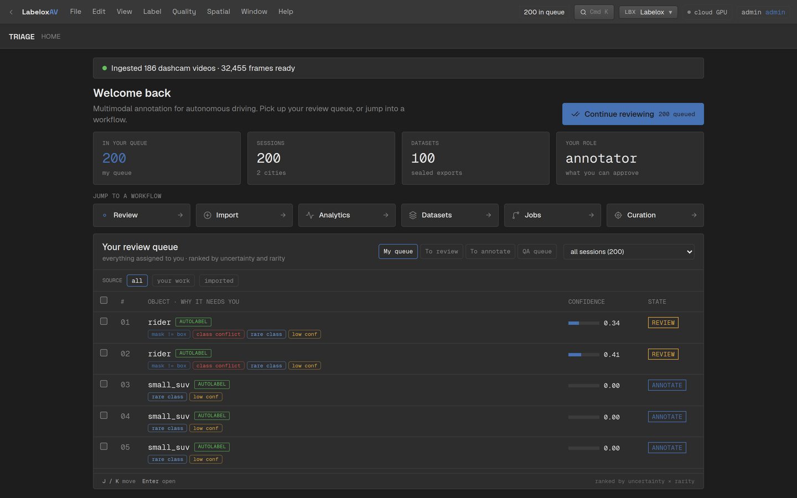

*The home dashboard: a full fleet of real dashcam drives ingested and ready (186 trips, 32,455 frames from Indian roads), with the review queue surfacing the long tail the models struggle on, police vans, vendor handcarts, autorickshaws, ranked by uncertainty and rarity so attention goes where it matters.*

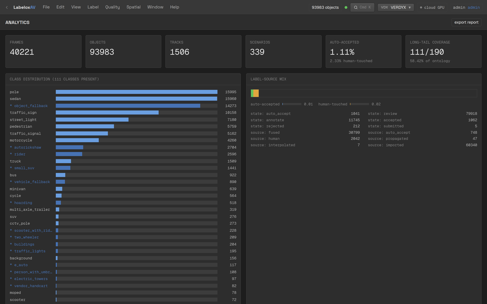

---

## The interface

A Blender-style dark workstation: neutral greys, a single blue accent that only appears on the active or primary control, rounded tool buttons, recessed value fields, and panels with named headers. Every control carries a tooltip and every panel a one line description, so the UI explains itself instead of assuming you already know it.

**One chrome, every screen.** Every dashboard renders inside a single shared shell, so the frame is identical wherever you are: a menu bar, a titled header with the page's primary action, an optional filter band, and content that scrolls under fixed chrome. Jump anywhere with a **Cmd+K command palette** that fuzzy matches every destination, and press **?** on any page for a searchable keyboard-shortcut reference.

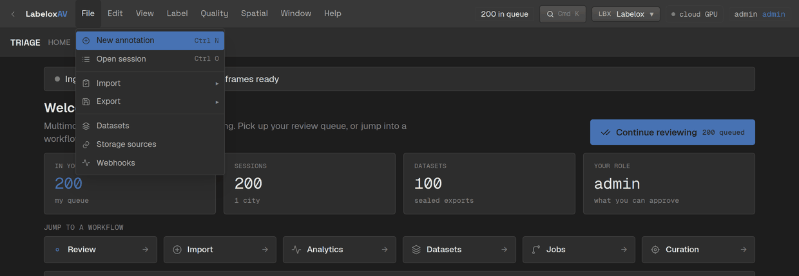

The navigation is a **menu bar**, not a row of buttons: File, Edit, View, Label, Quality, Spatial, Window, Help. Sections split by dividers, icon on the left, shortcut right-aligned, submenus on hover. The reason is boring and practical: buttons compete for horizontal space and eventually force a scroll or an overflow chevron, while menus stay one row at any number of destinations. Adding a destination is one entry in `web/lib/menus.ts`. The command palette reads the same definition, so the menu and the palette cannot drift apart.

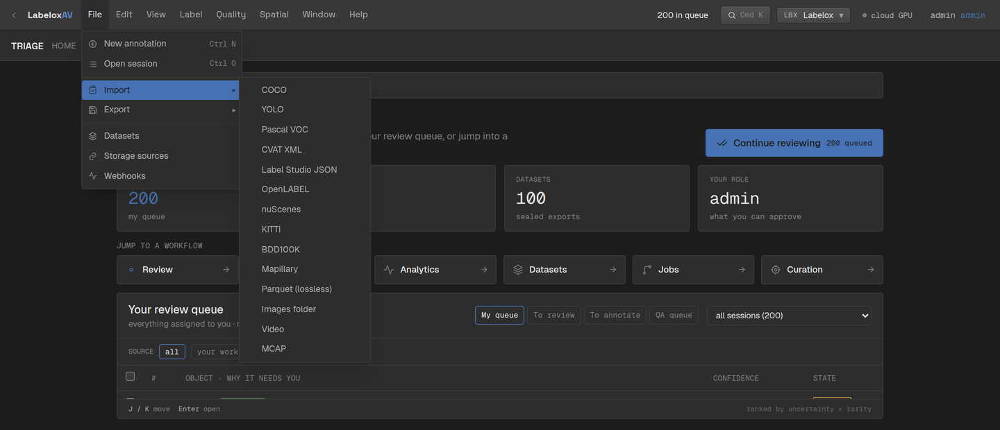

The whole engine is organized as **seven platforms** over one shared spine, navigable from a launcher and a platform switcher reachable anywhere. Data flows through them in flywheel order: ingest QA (SANYX), calibration (CALYX), curation and mining (SIEVYX), annotation (Labelox), offline pseudo truth (ORACLYX), evaluation (VERDYX), and edge deploy (FORGYX), then the loop closes as failures and coverage gaps feed the next collection and labeling cycle.

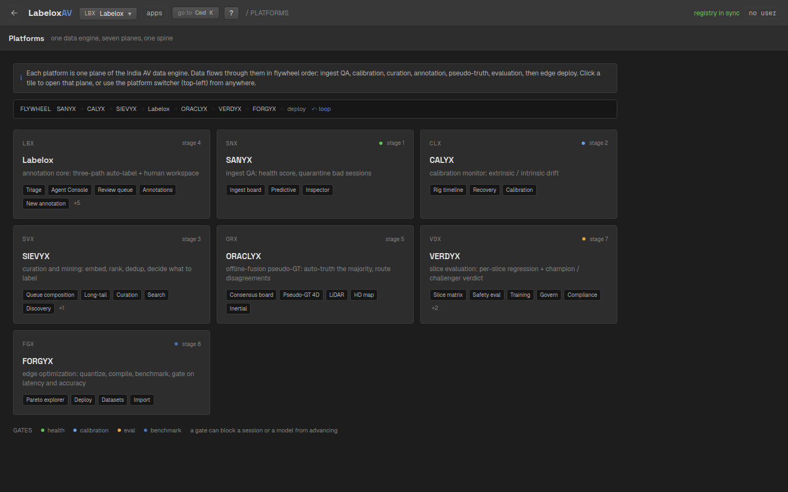

*The launcher: a self explanatory home. An intro that says what the engine does, a labeled flywheel strip showing how data moves between planes, a described tile per platform with a live state badge, and a legend for the gates that can block a session or a model from advancing.*

Each plane is a focused, self explanatory tool surface. The adaptive flywheel controller turns evaluation failures and ODD coverage gaps into a label budget allocation and a set of collection tasks, then records every cycle. The hardware in the loop deployment page co optimizes a model to its target silicon, verifies the thermal and power envelope from a real device farm run, and stages the rollout from canary to fleet with a rollback path.

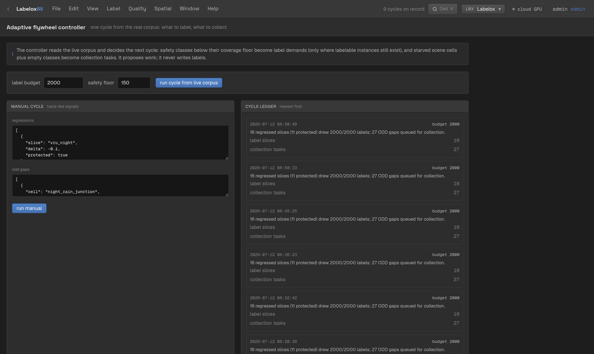

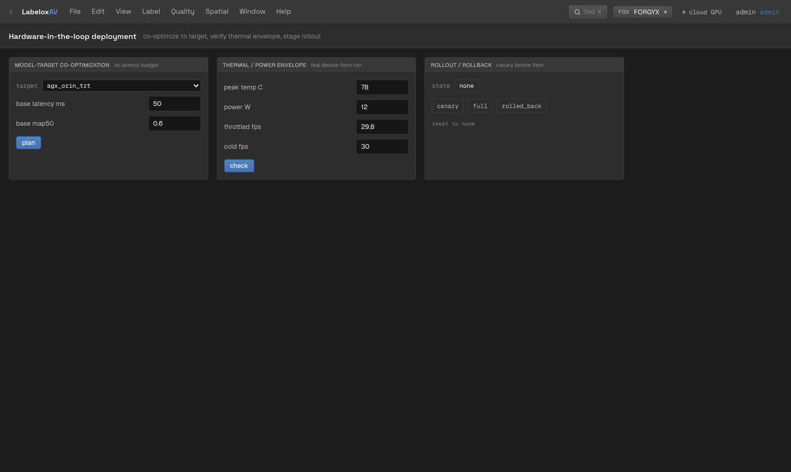

---

## Why this exists

Most perception models are trained on clean, orderly roads. Put them on an Indian street and they struggle: dense mixed traffic, classes that simply do not exist elsewhere, lane markings that are more of a suggestion, and safety critical moments buried under thousands of boring frames.

Labeling that data by hand is slow and expensive. The cases that actually matter are the hardest to find. LabeloxAV is the engine that turns drives into a training set that keeps getting better, while a person watches over it instead of clicking boxes all day.

---

## What it does

**One surface, every annotation primitive.** Boxes and oriented boxes, manual polygons, promptable SAM masks, pose and keypoint skeletons for pedestrians and cyclists, and 3D cuboids lifted from LiDAR, plus a measure tool and copy paste across frames. Edit lane splines and drivable area, read each object's derived dynamics, fix a wrong label in place, or add a brand new class on the fly. All keyboard driven. Here it is on a real Indian street: 55 objects on one frame, thirteen motorcycles, two autorickshaws and an e-rickshaw among them, each with its own calibrated confidence.

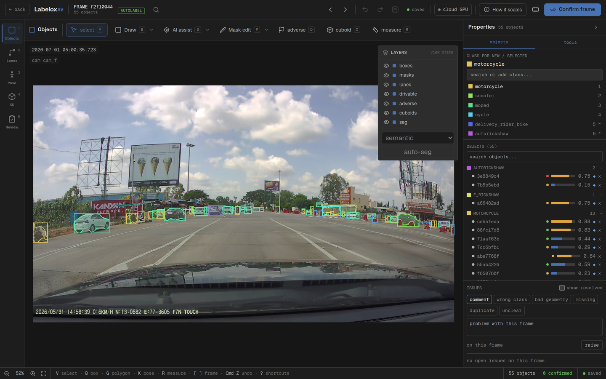

**An editor that stays out of your way.** The workspace is built around a fixed-width icon **mode rail**, one entry per task: Objects, Lanes, Pose, 3D, Review. Switching mode swaps the tool strip, the default panel, and the canvas without ever changing the layout. The **tool strip** groups the current mode's tools behind a mode prefix with flyouts, so it stays a single row no matter how many tools a mode owns, and a new tool costs zero layout. A quiet **canvas HUD** shows the frame time and camera top-left; a floating **layers** cluster toggles overlays; a **bottom bar** carries zoom, live counts, shortcut hints, and the autosave status; and the **properties panel** on the right is contextual and collapses first on a narrow screen to give the canvas the full width. A top bar keeps the icon actions and a single primary **Confirm frame** button, and a **How it scales** popover explains, in place, how the layout absorbs new features by grouping and mode rather than by growing.

**Start from raw data.** Drop in a folder of images, a whole batch of dashcam videos, or an mcap and it imports each into its own session with faces and plates blurred before anything reaches storage, then opens the first frame so you are annotating in seconds. The home shows live ingest progress across the batch, and sends you straight back to the highest priority frame left to label.

**3D from LiDAR, without a 3D engine.** Point clouds rasterize to a bird's eye view you annotate with oriented boxes, and each box lifts back to a metric 3D cuboid using the points it encloses. It exports as real nuScenes 3D. The shot below is the cuboid workspace with a real KITTI scan loaded: the three scans of the session on the left, the 3D view above, and the bird's eye view you draw boxes in below.

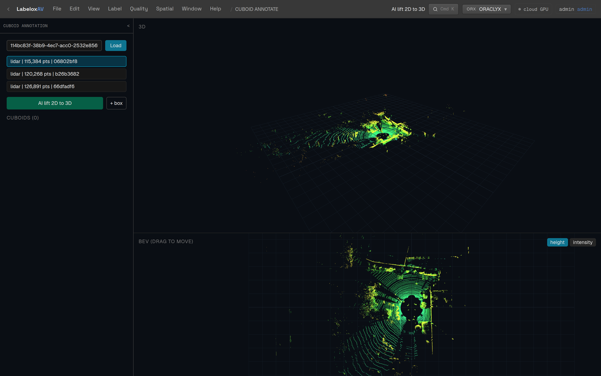

**Tried on a public dataset, start to finish.** Three Velodyne HDL-64E scans from the KITTI object set were downloaded from a public mirror and pushed through the whole path: read, stored, served, and rendered. 362,543 points across the three, and the viewer draws all 115,384 of the first one without decimating.

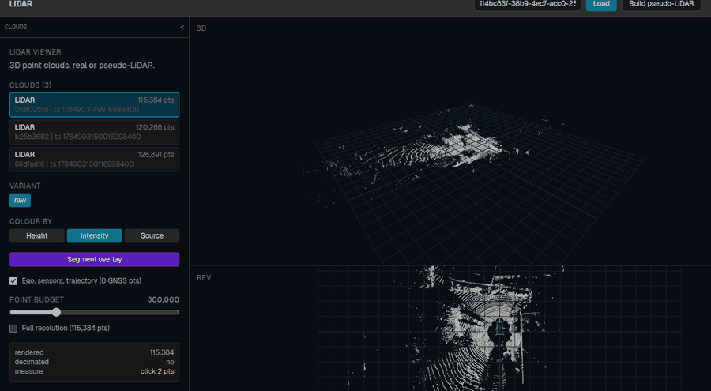

*Cycling the three scans, then switching the colour channel between height, source and intensity. The panel reports `rendered 115,384 / decimated no`.*

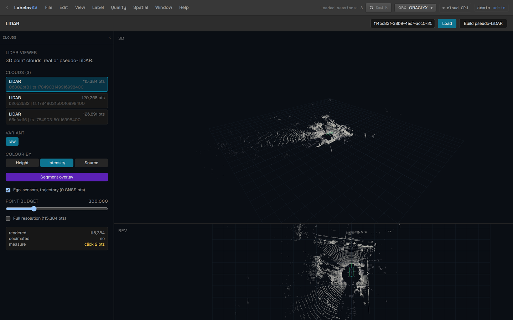

The processing is worth one honest detail. RANSAC ground segmentation put the road plane at **1.71 m, 1.68 m and 1.69 m** below the sensor on the three scans. KITTI mounts its Velodyne at roughly 1.73 m, so the fitted plane lands where the hardware actually sits, which is a much better check on the geometry than any number the code reports about itself. Ground came out at 31 to 64 percent of returns depending on how open the scene is, and voxel occupancy over a 80 by 80 by 6 metre volume took 0.08 to 0.15 s per scan.

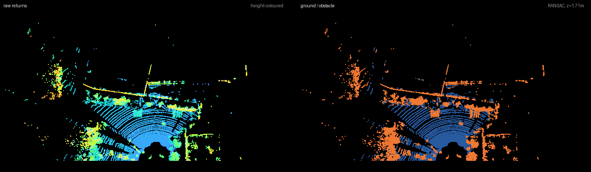

*Left, raw returns coloured by height, with the Velodyne ring pattern on the road and buildings picked out along the kerb. Right, the same scan split by the fitted ground plane: blue is ground, orange is everything standing above it.*

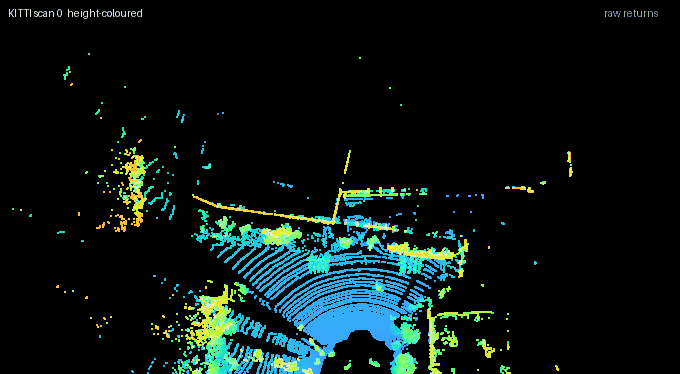

To be clear about scope: this is three frames from a public sample, not the full KITTI benchmark, and it exercises ingest, storage, serving, ground segmentation, occupancy and rendering. It does not train or evaluate a 3D detector.

**Every camera at once, on one canvas.** A vehicle carries a rig of cameras, so the same object shows up in several views at the same instant. LabeloxAV groups the synchronized frames, then lets you switch the editor into a rig view, a grid, a surround strip ordered the way the cameras face, or a focus plus context layout, with no change of mode and every tool working exactly as before. A dropped frame shows as an empty tile instead of vanishing. Work happens in two tiers, gated on calibration and honest about which one is available: on any session you link the same object across views by hand or from a DINOv3 appearance suggestion, and the rig identity votes a class and flags a cross view disagreement for review; on a calibrated session you annotate once and project the box into the other views by geometry, lens aware for the narrow and fisheye lenses. Objects are then followed across time and cameras as one rig track, and a consistency check files the views that disagree straight into the review queue.

There is no screenshot for this one, and that is the honest reason: every session in the ingested corpus is single-camera dashcam footage, so there is no real rig to photograph. The workspace runs, the sync grouping is real, and the tier logic is covered by tests, but until a genuine multi camera recording is ingested the surface has only ever been driven against synthetic sessions.

**Explore the corpus as structure, not as a list.** Objects are laid out by embedding similarity (UMAP over the DINOv3 vectors, with HDBSCAN clusters), so lookalikes sit together and outliers sit apart. Lasso a region and act on it in bulk: tag it, save it as a view, or send it to review. A facet rail on the left cuts by class, state, source, confidence, scene axis, city and tag, and each facet is computed with its own clause dropped, so a bar always answers "how many would I get if I picked this instead" rather than collapsing to the value you already chose.

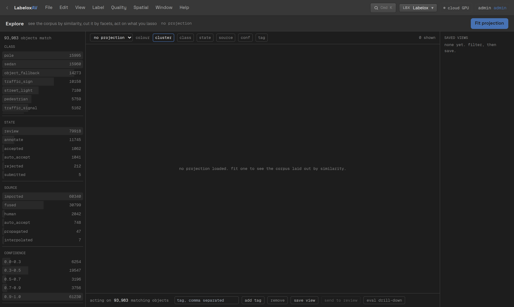

*Real counts from the ingested corpus: 93,983 objects, with the state, source, confidence and weather facets computed under the current filter.*

The filter you build here is the same predicate a curation slice stores, so a cut you like becomes a saved view and an export without being redefined.

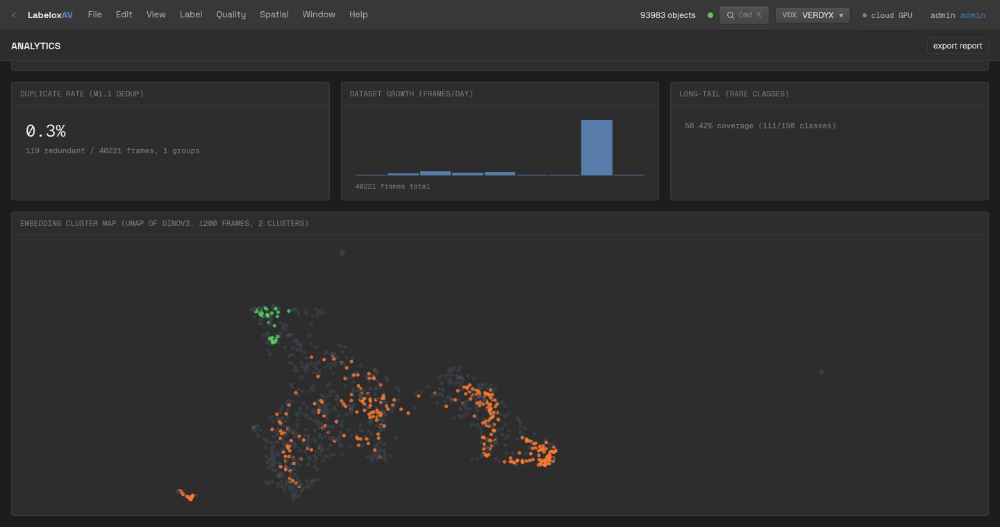

**Smart triage, not endless clicking.** Every detection gets a calibrated confidence and a reason. High confidence agrees get auto accepted. The uncertain, rare, and conflicting ones rise to the top of a priority queue. You spend your attention where it matters.

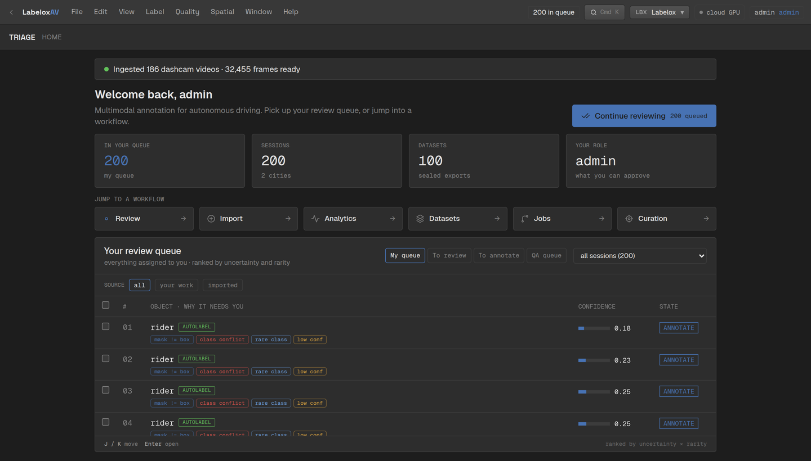

**Active learning that asks for the right frames.** Instead of labeling random data, the engine ranks every candidate by how much it would teach the model: uncertainty, diversity, rarity, and error proneness combined into a single value score. Label the top of the list, skip the redundant easy frames.

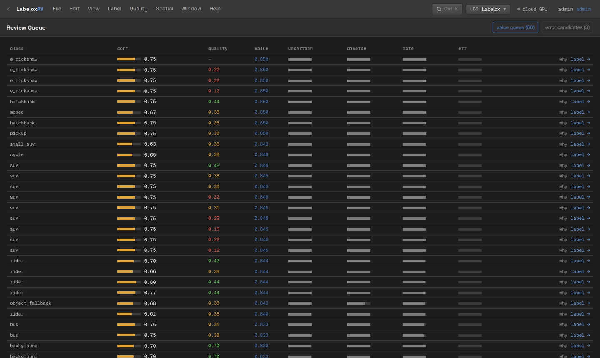

**Run a labeling team, not just a tool.** Work is organized as projects, tasks, and assignable jobs. A job moves along two independent axes: a **stage** (annotation, validation, acceptance) for where it sits in the pipeline, and a **state** (new, in progress, completed, rejected) for how far along it is within that stage. Keeping them separate is what lets the board say "in validation, not yet started", which one collapsed status cannot express. Jobs reference frames by id and never copy them, so a job is a view over the corpus.

A configurable fraction of each job is seeded with frames drawn from a sealed gold set. The annotator cannot tell them apart from real work, and on submit they are graded silently. A job that misses the project's accuracy floor is sent **back** in the same stage rather than advanced, because work that failed its own quality bar should not reach a reviewer looking like it passed.

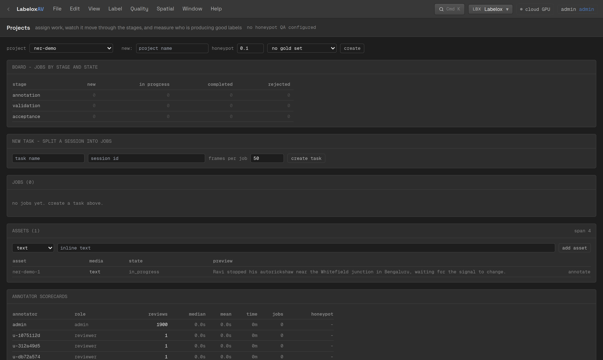

Reviewers leave **issues** anchored to a specific object, or to a region on a frame when the complaint is that something is *missing* and there is no object to point at. Scorecards report median time alongside the mean, because annotation times are heavily skewed and one interrupted session drags a mean well off what the work actually costs.

**Where the model disagrees with ground truth, and what that looks like.** A confusion count tells you pedestrians are being called poles; it does not show you the pedestrians. Scoring the machine labels against a sealed gold set records every individual outcome, so a cell opens into the actual crops.

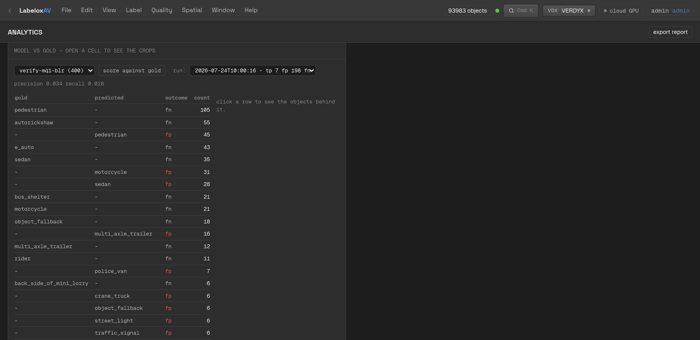

*A real run against a 400-object gold set. The largest cells are misses, not confusions: 105 pedestrians and 55 autorickshaws the machine labels never found on those frames. Clicking a row loads the crops behind it.*

**Beyond driving frames.** The same project, job and issue machinery also drives audio, text, time series, documents and LLM-evaluation tasks, through a second spine (`Asset` and `Annotation`) that sits beside the driving corpus rather than inside it. A project declares its own labels and typed fields, and one editor renders the right canvas for the media type.

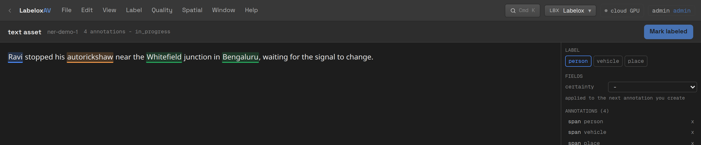

**A closed loop you can govern.** Corrections and mined hard cases feed a versioned training set. The model retrains, gets measured against a frozen gold set, and is promoted only if it beats the champion without regressing a safety class. Then it relabels the existing data, surfaces the errors that remain, and the cycle repeats. Over each turn the auto accept ceiling rises and human touches fall.

Every automated decision is in an audit log. A drift breach pauses promotion. One kill switch stops everything and rolls back to the last good model. Safety critical confusion, like a rider mistaken for a pole, is never automated to zero.

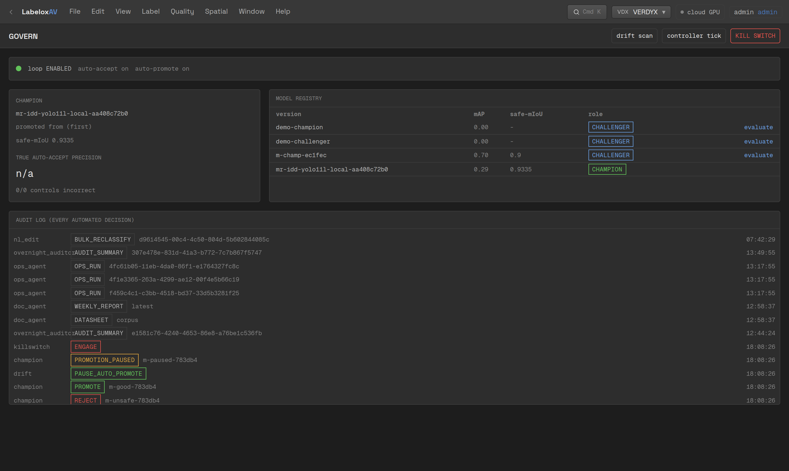

---

## The feature list

- **India first ontology**, 170 classes across vehicles, vulnerable road users, infrastructure, surfaces, and an honest long tail, with per object behavioral attributes (motion, brake, indicator, lane position, occlusion).
- **A full annotation toolkit**: boxes, oriented boxes, manual polygons, promptable SAM masks, pose and keypoint skeletons, 3D cuboids from LiDAR, a measure tool, and copy paste, with per object undo, optimistic locking so two people never clobber each other, and autosave.
- **Auto labeling** through a fusion of detection, promptable segmentation, and a vision language verifier, gated by calibrated confidence.
- **Perception depth**: multi object tracking, lane splines, drivable area segmentation, traffic sign and signal understanding, and license plate privacy that never stores plate text.
- **3D and LiDAR**: point clouds annotated in a bird's eye view, lifted to metric cuboids from the enclosed points.
- **Multi sensor and spatial**: camera calibration validation, synchronized multi camera annotation on one canvas (rig frame groups, manual and appearance based cross view linking, annotate once and project across views when calibrated, and cross view track handoff with a consistency check), map assisted labeling from OpenStreetMap, and HD map generation exported to Lanelet2 and OpenDRIVE.
- **Derived dynamics**: per object distance, speed, heading, time to collision, and a risk level, turning a perception dataset into one that supports planning and prediction.
- **Self improvement**: active learning, annotation error detection, AI assisted relabeling, champion and challenger promotion that actually serves the promoted model, a kill switch that genuinely stops auto accept, control sample precision, drift detection with recovery, and a full audit trail.
- **A standing agent workforce**: an Agent Console that runs autonomous QA overnight (error sweeps, temporal repair, a reviewable fix queue) and an "Ask LabeloxAV" operations agent that turns a plain sentence into a plan over the real endpoints, pausing for confirmation on anything destructive. Agents only propose; the gates dispose, and every action is a reversible, audited run.
- **A unified workstation**: every dashboard shares one dark, self explaining chrome, with a menu bar carrying every destination, a Cmd+K command palette that reads the same definition, and a press-? shortcut reference on every page. The frame editor is a mode-rail workspace (Objects, Lanes, Pose, 3D, Review) whose grouped tool strip stays a single row no matter how many tools a mode owns.
- **Export and import**: COCO, YOLO, Pascal VOC, KITTI, BDD100K, OpenLABEL, nuScenes (with real 3D when a cuboid exists), CVAT XML, Label Studio JSON, and a lossless Parquet round trip. The CVAT and Label Studio adapters are written as mirrored pairs and tested by round trip, since a format adapter that only works one way is a trap.
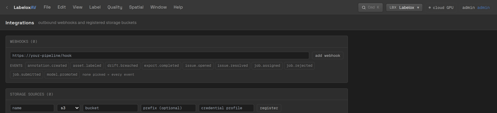

- **Integrations**: outbound webhooks signed with an HMAC per subscription (an unsigned webhook is an unauthenticated write into whatever it triggers), registered S3/GCS/Azure source locators that deliberately store no credentials, and a thin Python SDK and CLI over the same REST API the web app uses.
- **Secure and versioned**: deny by default API auth with annotator, reviewer, and admin roles, git style branches and reviewed merges over the dataset, and a mandatory privacy gate.

---

## Architecture

```
Fleet footage
   |
   v
Ingest  ->  Auto label (confidence gate)  ->  Triage and review
   |                                              |
   |                                              v
Embeddings, search, rare scenario discovery   Corrections
   |                                              |
   v                                              v
HD maps, calibration, dynamics            Active learning
                                               |
                                               v
                       Retrain  ->  Champion gate  ->  Relabel  ->  Error detection
                                       (governed, audited, reversible)
```

**Stack.** Python and FastAPI, Next.js and Tailwind, Postgres with PostGIS and pgvector, MinIO object storage, Redis, Redpanda, and lakeFS for dataset versioning. Models run on PyTorch with a clean local to cloud seam.

---

## Multi-domain: one engine, two domains

The engine is no longer single-domain. Everything domain-specific lives behind a `DomainPack` contract, so the same spine (ingest QA, calibration, curation, auto-label, pseudo-truth, eval, edge deploy) runs a second domain without a fork. The AV data engine is now the `av` pack; **LabeloxSec**, for India CCTV and security footage, is the `sec` pack. Both load in one process; the engine core imports no concrete pack, and CI enforces that with an import contract. A per-pack golden digest freezes every surface, so the AV pack is provably byte-identical after the refactor: a hard parity gate.

What a pack carries: its ontology, its safety definition, its auto-label profile (VLM prompt, anchors, class maps), its eval strata, its scene model, its ingestion adapter, its privacy plane, and its edge targets. The AV pack keeps the moving-camera world (ego-motion, the road ground plane, the VRU/animal safety set, DPDPA face and plate redaction, Jetson silicon). The Sec pack swaps in a **static-camera scene model** with a per-camera background prior, a security ontology (person, weapon, baggage, animals, infrastructure), a person-and-weapon safety set, CCTV forge targets (Ambarella, Axis ARTPEC, Hailo, OpenVINO, x86 ONNX), and **ANPR-India**.

**The static camera fork.** A fixed camera has no ego-motion but a stable background a moving camera never has. The static scene model derives a per-camera background prior (temporal median), and everything that differs from it is foreground: a model-free "what moved" signal for curation and events.

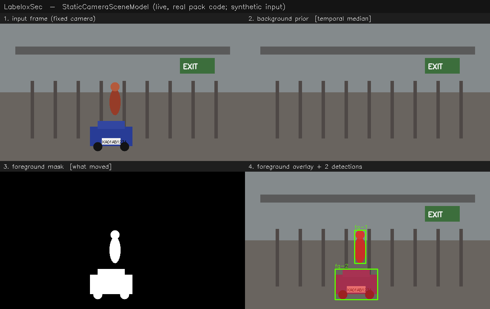

*The static-camera pipeline running live on the Sec pack code: a fixed-camera frame, the recovered background prior (temporal median, moving objects averaged out), the foreground mask, and the detections. Input here is procedural; the algorithms are the shipped pack code.*

**ANPR-India, and the compliance line it draws.** LabeloxSec reads Indian number plates for an authorised security purpose. The AV engine does the exact opposite: plates are personal data under the DPDPA, blurred by the privacy plane and never read. That contradiction is resolved by the pack: ANPR is gated on the `sec` capability and *refuses under the AV pack*, so plate reading can never run in the privacy-first context. The plate-format kernel (state, RTO district, series, number; standard, Bharat-series, diplomatic marks, validated against the real RTO codes) is pure and fully tested; the OCR is a wired model seam, never a fabricated reader.

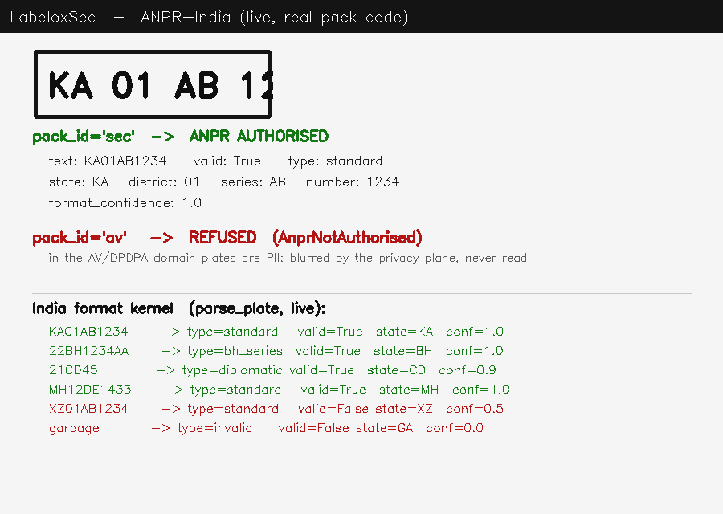

*ANPR-India running live: the Sec pack authorises the read and parses the mark; the AV pack is refused by the capability gate; and the India format kernel across standard, Bharat-series, diplomatic, and invalid plates.*

The pattern generalises: a third domain is a third pack, not a third fork.

---

## Quick start

```bash
# bring up the infrastructure (Postgres, MinIO, Redis, Redpanda, lakeFS)
make up

# install and migrate
uv venv && uv pip install -e .
alembic upgrade head
python scripts/seed_ontology.py

# run the API and the web app
make api      # http://localhost:8000
make web      # http://localhost:3000
```

Open the web app, click New to upload images or video, or Open to pick an existing session, and start annotating.

---

## Models

Detectors live in a versioned registry, trained on the India Driving Dataset and a general 8 class set. A fresh size family, trained on a single consumer GPU:

| Model | Backbone | Data | mAP@50 | Precision | Recall |
| --- | --- | --- | --- | --- | --- |
| idd-yolo11l | YOLO11l | IDD | 0.44 | 0.67 | 0.39 |
| idd-yolo11n | YOLO11n | IDD | 0.34 | 0.67 | 0.30 |
| roadscope-yolo11l | YOLO11l | general | 0.72 | 0.73 | 0.65 |

The IDD model reaches 0.44 mAP@50, up from an earlier 0.39 baseline, while the tiny YOLO11n trades accuracy for speed so it can run on the vehicle. These are modest numbers on a hard dataset: the models do reasonably on common road agents and poorly on the rare India specific long tail, which is the gap the active learning loop exists to close. Every model is promoted only through the champion and challenger gate above.

## Honest status

This is a from scratch build of the full pipeline, backed by an automated test suite. What follows separates what has been exercised on real data from what has only been written and type checked, because those are not the same claim.

**Exercised on real data.** A fleet of real dashcam drives is ingested: 186 trips and 32,455 frames from Indian roads, with faces and plates blurred before anything reaches storage. That operational fleet has now been auto-labeled end to end: **32,153 of its 32,455 frames (99.1%) carry detections**, and every object in the corpus has a DINOv3/SigLIP2 embedding (**583,281 of 583,514, 100%**), so find-similar and the embeddings map run on the whole fleet rather than a public-dataset sliver. Counting everything in the database, that is 40,221 frames and 583,514 objects. Semantic segmentation models run drivable surface and lane geometry across it through the cloud GPU seam, which starts a pod, runs the sweep, ingests the result and stops the pod to cap billing. A real KITTI LiDAR scan is annotated to 3D cuboids and exported as nuScenes. Detectors in the registry are trained on the India Driving Dataset. The explorer, the faceted counts, bulk tagging, similarity search reranked for diversity, the job and honeypot workflow, the model-versus-gold drill-down, dataset export (a DASHCAM-01 fleet slice sealed to a versioned COCO/YOLO commit), the CVAT and Label Studio round trips, and signed webhook delivery have each been driven end to end against this running stack.

**Written and type checked, but not yet exercised on real media.** The audio (waveform and region) and document/OCR editors have no sample audio or scanned pages in the corpus to run against, so they are unproven in practice. Storage-source listing is implemented for S3-compatible stores only; GCS and Azure register as locators but return an explicit "listing not implemented" rather than keys.

**Known gaps in the test suite.** 751 tests pass. Thirteen fail for reasons unrelated to correctness of the features above: some require services that are not running locally (lakeFS, Ollama, a video codec), and a cluster of four encode gate thresholds that no longer match the configured values. That last group is deliberately left failing rather than updated, because rewriting the assertions to match current behaviour would hide a real change to the auto-accept threshold if it was not intended.

**Not yet done.** The first half of the closed loop has now been run at scale, autolabel across the whole operational fleet with embeddings kept current by a continuous embedder. The second half has not: human-review the mined hard cases (the gate-directed labeling batches surface exactly which safety classes block promotion), retrain, and watch the auto-accept ceiling move. No operational champion has been promoted yet, because the safety gate correctly holds until VRU and cattle recall clear their floors, and that needs reviewed labels, not another autonomous pass. The model-versus-gold numbers in this README (precision 0.034, recall 0.018 on a 400-object gold slice) are exactly the kind of result that second half exists to improve, and they are reported here unflattering and unrounded.

The test suite once wrote to the same database as production and left synthetic frames behind. That is fixed at the source with an isolated test database, CI, and an ingest gate that rejects corrupt frames, and the residue was quarantined.

---

## Calibration and trust

A session that fails camera calibration is flagged and excluded from metric 3D work until it is fixed. Multi camera annotation degrades honestly rather than blocking: an uncalibrated session still gets manual cross view linking (Tier 1), and only a calibrated one unlocks annotate once and project across views (Tier 2). Trust is earned per session, not assumed.

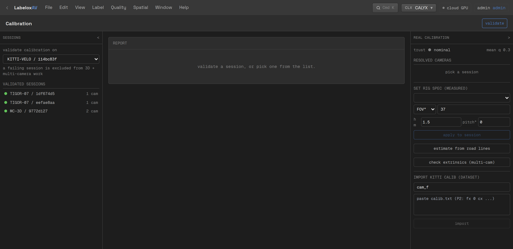

---

## Author

**Sherin Joseph Roy**

Building an India native, self improving data engine for autonomous driving.

---

## License

Copyright (c) 2026 Sherin Joseph Roy. All rights reserved.
